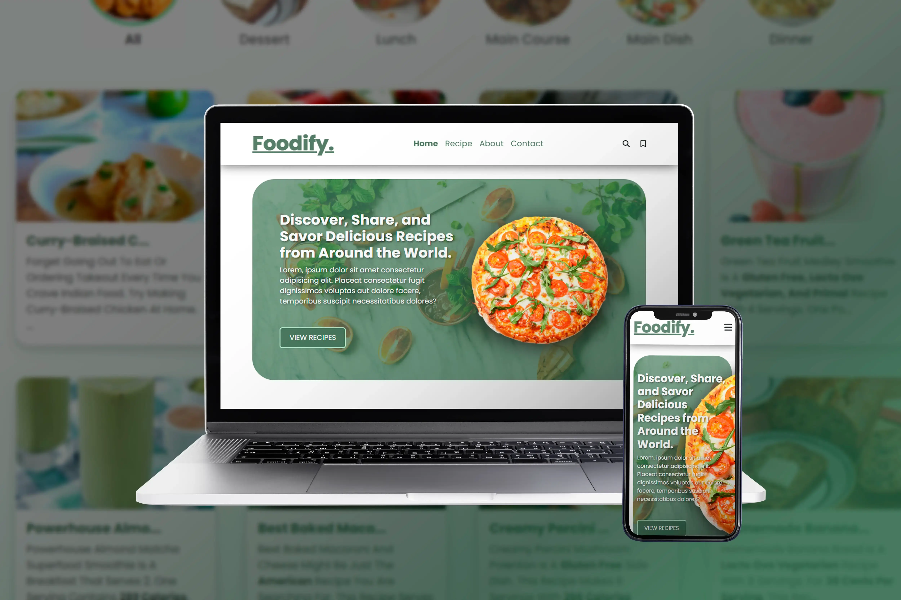
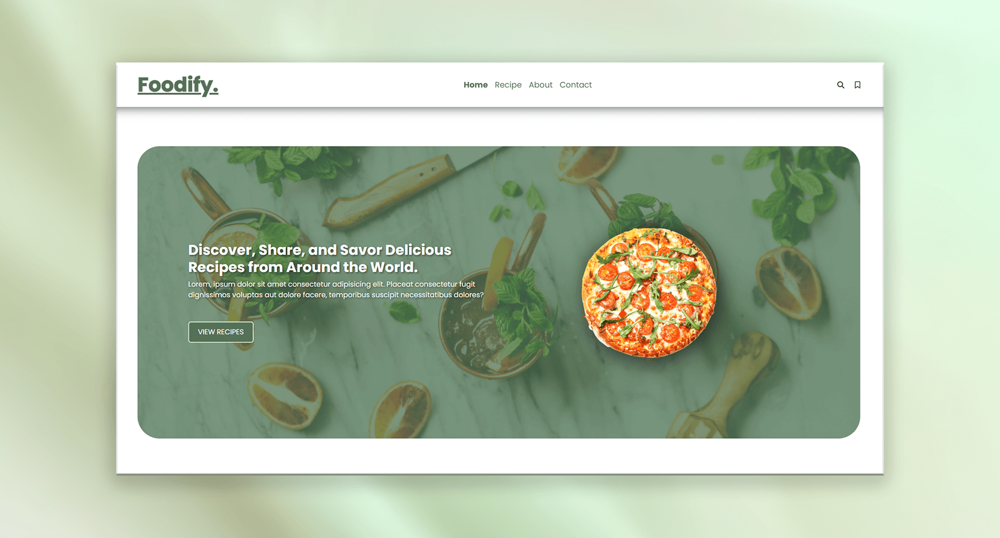
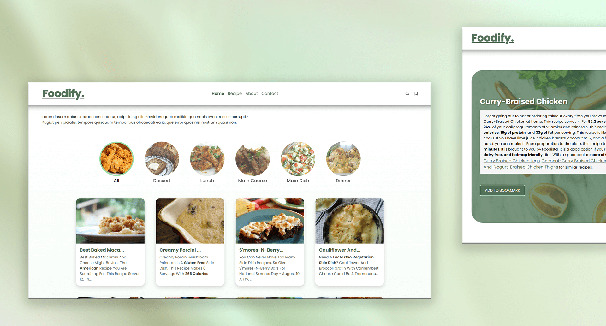
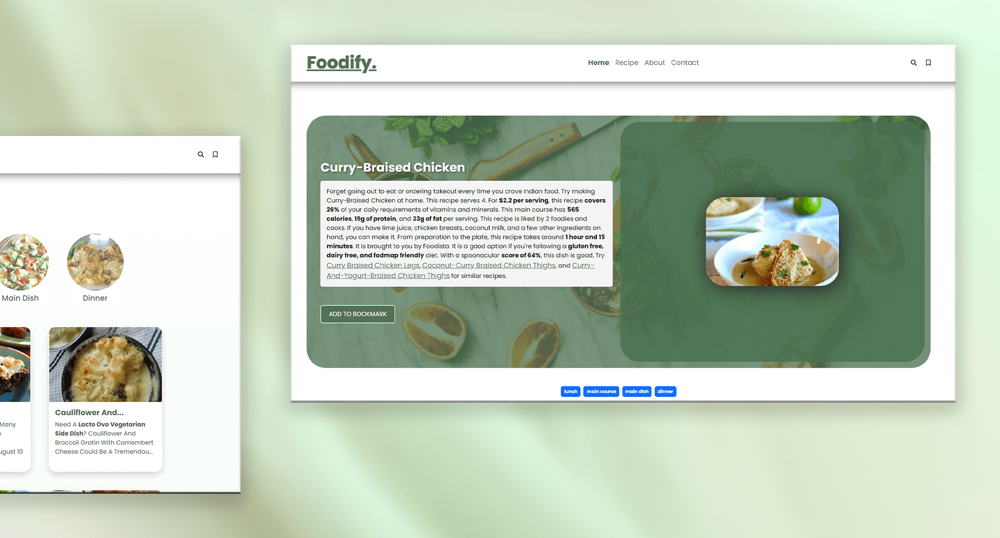
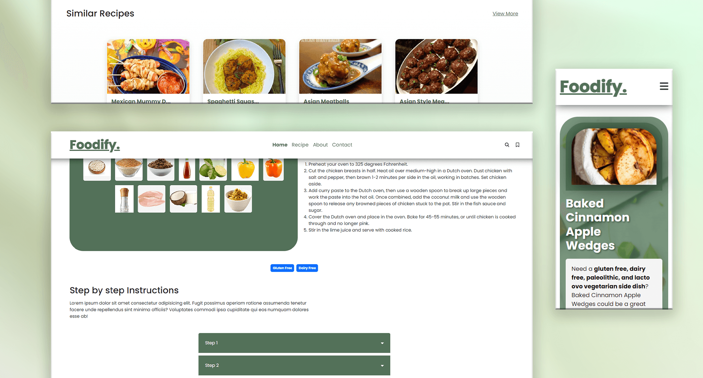
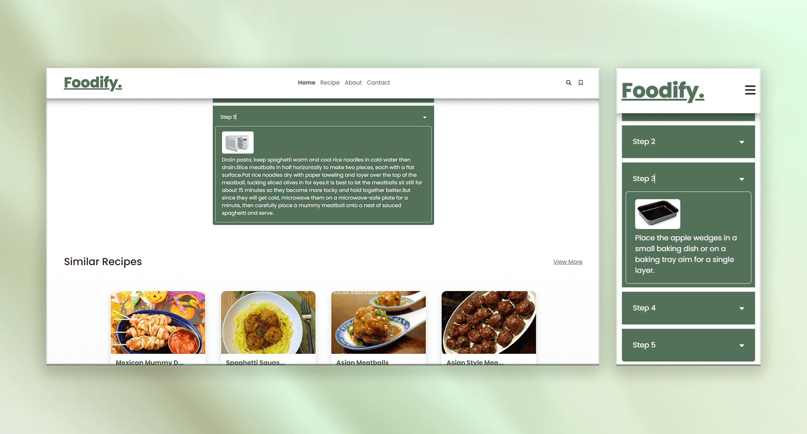

# Foodify – All Food-related Recipe

## 📌 Overview

Foodify is a comprehensive platform designed to provide users with access to a wide variety of recipes and detailed cooking procedures. The application categorizes dishes into various types such as desserts, lunches, steaks, and more. Each recipe comes with an ingredient list, step-by-step instructions, and nutritional information to help users make informed decisions about their meals.

Food API: https://spoonacular.com/food-api

The app leverages the Spoonacular API, a powerful food-related API that aggregates data from various sources to provide detailed recipes, ingredient information, and nutritional breakdowns. With this API integration, Foodify offers users access to an extensive collection of recipes and food-related data.

With its user-friendly interface, Foodify makes it easy to search for recipes by category, ingredient, or cuisine, providing a seamless experience for both amateur and experienced cooks. The app also offers personalized recipe suggestions based on user preferences and dietary restrictions.

🔗 **Live Demo:** <a href="https://quiztwist-frontend.vercel.app/" target="_blank">https://quiztwist-frontend.vercel.app</a>

---

## ✨ Features

-   Recipe Variety: Offers a wide range of recipes categorized into different food types like desserts, lunches, steaks, etc.
-   User-Friendly Interface: Simple and intuitive design, making it easy to browse and search for recipes.
-   Personalized Suggestions: Recommends recipes based on user preferences and dietary needs.
-   Step-by-Step Instructions: Detailed cooking procedures for each recipe to ensure accurate preparation.
-   Nutritional Information: Provides essential nutritional data to help users make informed food choices.

---

## 🛠️ Technologies Used

**Frontend & Design:**

-   HTML
-   CSS
-   JavaScript
-   Bootstrap CSS
-   Laravel
-   React.js
-   SQLite
-   Api

**Design Tools:**

-   Figma
-   Adobe Photoshop

---

## 🖼️ Screenshots

|  |  |
| :-------------------------------------------: | :-------------------------------------------: |
|  |  |
|  |                                               |

---

## 📁 Project Type

-   🎨 Design
-   💻 Development

---

## 📂 Tags

-   `Food-App`
-   `Recipe-Platform`
-   `Ingredient-Management`
-   `Personalized-Suggestions`
-   `Web-Application`

## 🙋‍♂️ About the Developer

Hi! I’m **Wilhelmus**, a Full Stack Web Developer and Web Designer passionate about building impactful digital experiences.

-   <a href="https://wilhelmus.vercel.app/?ref=github_quiztwist" target="_blank">Portfolio</a>
-   <a href="https://www.linkedin.com/in/wilhelmusolejr/" target="_blank">LinkedIn</a>
